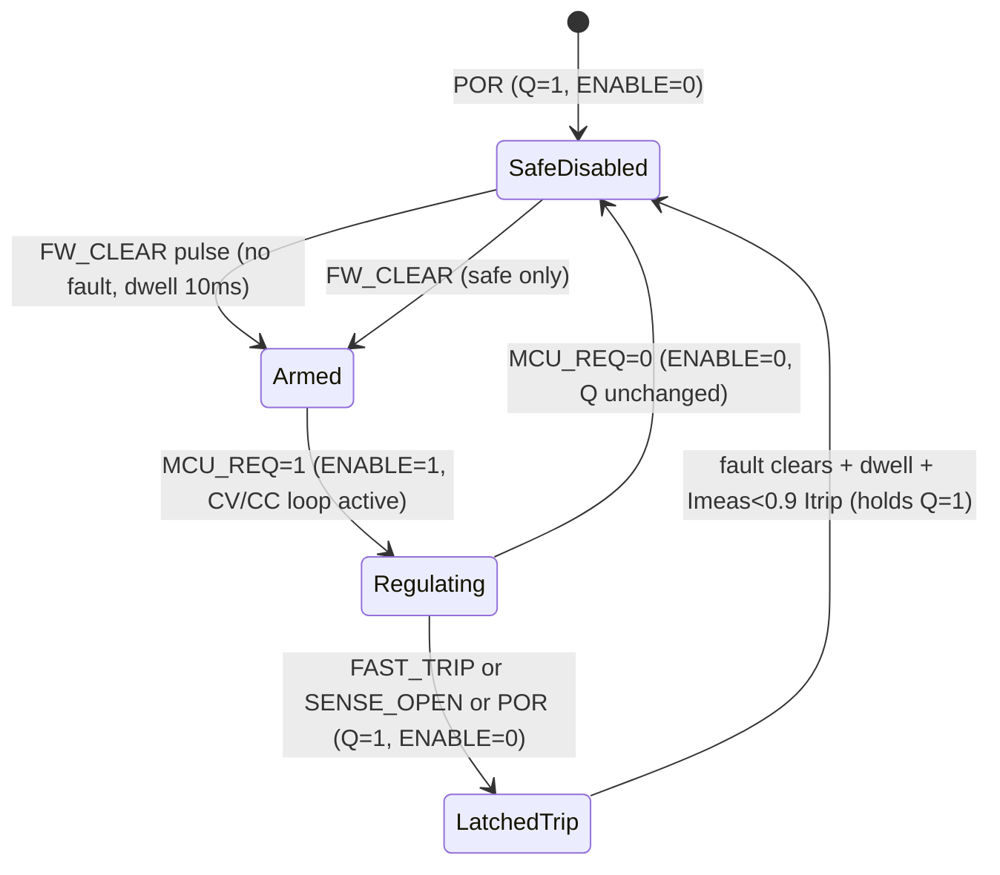

# 07 Compliance Trip — Latch / Disable Logic

**Project:** ReRAM-SMU V1 — Phase 7 Schematic Capture  
**Sheet:** `07_COMPLIANCE_TRIP` (`hardware/kicad/ReRAM-SMU-V1/sheets/07_COMPLIANCE_TRIP.kicad_sch` Rev 0.2)  
**Date:** 2026-08-25  
**Status:** `DETAILED — READY FOR LAYOUT REVIEW` (ERC waivers for skeleton cleared in detailed)  
**Companions:** `COMPLIANCE_ARCHITECTURE.md` (§3), `COMPLIANCE_ENERGY_ANALYSIS.md` (IR-14), `PHASE3_INDEPENDENT_REVIEW_CORRECTIONS.md` (IR-01/IR-08), `08_MCU_USB_CONTROL` ENABLE generation  

---

## 1. Principle — Two Loops, Two Jobs

| Loop | What it does | Precision | Latched? | Logged as |
|------|--------------|-----------|----------|-----------|
| **Continuous CC** (LT1970 ISRC/ISNK via shared shunt 2.5Ω–1MΩ, Vc=Vs·10) | **Regulates** flat CC at programmed `Icc_reg` (per-segment, per-polarity). SMU stays in circuit, reading valid but drooped. | **Precision** — 1% LT1970 + 0.1% shunt + DAC INL 305µV. Floor 4 mV/40 mV, linear 6 mV/60 mV (DEC-024). | **Not latched** — flag follows operating point | `compliance_flag=REG`, `Icomp_reg`, `Imeas≈Icc` |
| **Emergency trip** (TLV3501 window comparator, <5 µs) | **Supervisor** — loose threshold **120–150% of `Icc_reg`** (range-dependent). Takes SMU **out of circuit** (high-Z). Reading during fault is **not** a valid operating point. | **Loose** — 6.5 mV Vos + 6 mV hyst + shunt/DAC error = 6.5% @100 mV FS, 26% @25 mV → **supervisor, not regulator** (IR-08) | **Latched** — output disabled until explicit firmware `CLEAR` | `FAULT_OC`, `OUTPUT_DISABLED`, latched |

> **Compliance keeps the SMU in the circuit and tells you so; a trip takes the SMU out of the circuit and tells you so.**

Only the continuous loop is the “compliance regulation” per REQ-SAFE-001. The TLV3501 is **not** a second regulator — it is an independent fault catcher that survives MCU halt.

---

## 2. Threshold Generation — Two Provisioned Options

### B1 — Spare DAC channel (PRIMARY, stuffed)

```
AD5764 ChD (0–5 V, 16-bit, 76 µV LSB on 5 V span half-codes → after OPA140 buffer 1×)
  → R 1k + C 10 nF (DAC noise filter, 16 kHz)
  → OPA140 unity-gain buffer (Ib 10 pA, Vos 120 µV, low drift)
  → VTRIP_REF (0–5 V) → TLV3501 IN− (via 100 R)
```

- Firmware sets **per segment, per polarity**: `Vtrip = 1.2–1.5 × Vc_reg` (see §3 table).  
- DAC update before segment arm (<1 ms), settled to 0.1% before segment start.  
- Buffer ensures R-2R loading not injected back into DAC (per TI SBAA332).  
- OPA140 chosen over ADA4522 for lower Ib on high-Z trip node (10 pA vs 50 pA); offset 120 µV is negligible vs 6.5 mV comparator Vos.

### B2 — Scaled VCSRC/VCSNK divider (ALTERNATE, DNP)

```
VCSRC (or VCSNK) ── 20 k 0.1% ──┬── 100 k 0.1% ── GND  → Vtrip = VCSRC × (100/(20+100)) × (1/0.833) ≈ 1.2 × Vc
                     buffered via same OPA140 footprint (select stuff option)
```

- No extra DAC channel, but **fixed ratio** — not per-segment programmable beyond Vc itself.  
- Tolerance: 0.1% divider → 0.2% ratio error + TC 10 ppm → acceptable vs 6% comparator budget.  
- Reserved as fallback if DAC channel needed elsewhere; **not stuffed in REV-A**.

> **Worst-case tolerance stack (both options):**
> shunt 0.1% + DAC INL ±305 µV (≈1.2% @25 mV) + ADA4522 pre-gain offset 5 µV + TLV3501 Vos 6.5 mV (26% @25 mV, 6.5% @100 mV) + hyst 6 mV.  
> Hence the **120–150% loose window** — a 100% precise threshold would false-trip or miss.

**Firmware contract:** `SEG_CONFIG[n].Icc_reg` → `Vc_reg = 10·Icc·Rshunt`; `SEG_CONFIG[n].Icc_trip = 1.2–1.5× Icc_reg`; `Vtrip = 10·I_trip·Rshunt / G_pre` (G_pre = 25–100× pre-gain if amplified sense). Log both.

---

## 3. Emergency Trip Threshold Table (REV-A shared shunt, amplified sense)

Amplified shunt sense (ADA4522 + OPA140) brings all ranges to ~2.5 V FS at TLV3501 input, but raw Vs shown for stack:

| Range | Rshunt | FS Vs | G_pre | Vs at FS → Vout | Vtrip (loose) | % FS | Notes |
|-------|--------|-------|-------|-----------------|---------------|------|-------|
| 10 mA | 2.5 Ω | 25 mV | 100× | 2.50 V | **150% = 3.75 V** (clamped to 2.5 V rail → use 3.3 V logic, effectively 132%) | 150% ideal, 6.5 mV Vos = 0.26% of Vout | High-current, hyst dominates |
| 1 mA  | 25 Ω  | 25 mV | 100× | 2.50 V | 150% | — | — |
| 100 µA| 500 Ω | 50 mV | 50×  | 2.50 V | 150% | 6 mV hyst = 0.24% | Standard |
| 10 µA | 5 kΩ | 50 mV | 50×  | 2.50 V | **130% = 3.25 V** (use DAC limit 3.3 V) | — | Lower FS margin |
| 1 µA  | 100 kΩ| 100 mV| 25×  | 2.50 V | **130%** | — | — |
| 100 nA| 1 MΩ | 100 mV| 25×  | 2.50 V | **120% = 3.00 V** | — | Tightest, leakage-critical |

*If raw Vs used without pre-gain (debug mode): Vos 6.5 mV = 26% @25 mV — demonstrates why amplified path is mandatory.*

---

## 4. TLV3501 Comparator Stage

- **Part:** TLV3501AIDR (dual, SOT-23-6, 4.5 ns, push-pull, 2.7–5.5 V single supply, rail-to-rail input includes GND, Vos 6.5 mV max / 1 mV typ, hysteresis 6 mV internal + external 1 M feedback sets ~6 mV).  
- **Supply:** `+5V_A` decoupled 100 nF C0G + 4.7 µF X7R at device (<5 mm).  
- **Inputs:** `IN+` = amplified shunt (via 100 R + 100 pF filter), `IN−` = `VTRIP_REF` (via 100 R). Common-mode 0–2.5 V on 5 V supply.  
- **Two comparators:** `U7A` sources source-direction (positive Vs), `U7B` sinks sink-direction (negative Vs, inverted via diff). Outputs **diode-ORed (BAT54S) → `FAST_TRIP`** (active high).  
- **Blanking:** `R 1 k + C 2.2 nF DNP` on `FAST_TRIP` node → ~2 µs blanking rejects `I = C·dV/dt` inrush on range change/autorange (holdoff still mandatory per REQ-MEAS-004).  
- **Independence:** TLV3501 powered from `+5V_A` (analog), reference from same DAC buffer but **independent of LT1970 loop amp supply** — survives LT1970 single-fault.

---

## 5. Latch / Disable Logic

### 5.1 Topology

```
FAST_TRIP ─┬─ BAT54S ─┐
SENSE_OPEN ─┤ BAT54S ─┼─► 10k pull-down ─► SR Latch S (active high, OR)
POR ────────┤ BAT54S ─┘              │
                                 ┌───┴───┐
FW_CLEAR ──► 10k PD +1nF ────────►│  SR   │─► Q ─► ENABLE gate (AND) ─► LT1970 ENABLE (10k PD, active high)
                                 │ LATCH │   └─► FAULT_LED + MCU IRQ
                                 └───┬───┘
                                     Qb ──► MCU FAULT_LATCH_QB
```

- **SR latch:** `SN74LVC1G74` (single D-FF wired as SR) or `SN74LVC2G00` cross-coupled NAND or `MAX16054` dedicated supervisor. **SET dominant** — asynchronous SET overrides RESET.  
- **OR node:** diode-OR (BAT54S) + 10 k pull-down ensures any high drives S high; leakage <1 µA vs 100 µA drive.  
- **Inputs:**

| Signal | Source | Active | Meaning |
|--------|--------|--------|---------|
| `FAST_TRIP` | TLV3501 OR | high | I exceeded 120–150% threshold (<5 µs) |
| `SENSE_OPEN` | Reed-switched open-sense detector (sheet 04, <1 pA reed) | high | SENSE_HI/LO disconnected during measurement — force would be uncontrolled |
| `POR` | STM809 / supervisor (sheet 08, 240 ms) + WDG timeout + brown-out | high | Power-up, brown-out, or watchdog reset |

- **RESET:** `FW_CLEAR` — MCU GPIO `PB2`, **pulsed high (>10 µs)** only when **all faults de-asserted** and **dwell ≥10 ms** after fault clear and **`Imeas < 0.9 × Itrip`** confirmed. Latch is **not** cleared by power cycle alone if fault persists.

### 5.2 Truth Table

| `FAST_TRIP` | `SENSE_OPEN` | `POR` | `FW_CLEAR` (pulse) | Q (FAULT) | ENABLE | Comment |
|-------------|--------------|-------|---------------------|-----------|--------|---------|
| 0 | 0 | 0 | 0 | *holds* | `MCU_REQ AND NOT(Q)` | Idle — ENABLE follows MCU |
| 1 | X | X | X | **1** (SET) | **0** (forced) | Trip → latch, ENABLE low regardless of MCU |
| X | 1 | X | X | **1** | **0** | Sense open → latch |
| X | X | 1 | X | **1** | **0** | POR → latch, also holds NRST |
| 0 | 0 | 0 | **1** (and dwell OK) | **0** (RESET) | `MCU_REQ` | Firmware clear only when safe |
| 0 | 0 | 0 | 1 (but fault still high) | **1** (holds) | **0** | **Ignored** — SET dominates |
| X | X | X | 0 | **1** (latched) | **0** | Stays latched until explicit clear |

### 5.3 State Diagram



### 5.4 ENABLE Generation (hardware, not firmware)

```
ENABLE = MCU_ENABLE_REQ  AND  NOT(FAULT_LATCH_Q)
        (SN74LVC1G08 AND gate, 10k pull-down on ENABLE node, 100 pF filter)

MCU_ENABLE_REQ: PA15 push-pull, 10k pull-down (default low = disabled).
FAULT_LATCH_Q: active high = fault → inverted via NAND/AND.

LT1970 ENABLE pin: active HIGH enable (per 1970afc), 10k pull-down to GND.
  → Power-up, MCU tri-state, WDG reset, or latch set all give ENABLE=0 (disabled, high-Z).
  → No firmware path can enable while Q=1.
```

- Supervisor `STM809` also **directly pulls ENABLE low** via open-drain + diode-OR (redundant with latch) — survives latch supply fault.
- Optional series load switch (ADG1419 or AO3400) after `R_iso` gated by same `Q` — quarantines upstream `C_comp` (`≤10 nF`) from DUT downstream `C_down` (`≤150 pF`) — **provision DNP**.

### 5.5 Firmware Rules (REQ-SAFE-001 “with MCU halted” test)

1. **Pre-arm:** verify `Icomp_reg ≤ I_range` (or autorange raises), set `VCSRC/VCSNK` (`Vc=10·Icc·R`), set `VTRIP`, wait 1 ms DAC settle + 24 ms range settle before `MCU_REQ=1`.  
2. **During sweep:** log every sample `{range, Icomp_reg, Icomp_trip, compliance_flag, fault, ENABLE, temp}`. Trip point is **not** logged as valid I–V — gap the line.  
3. **On `FAULT_QB` interrupt:** set `MCU_REQ=0`, halt sweep, log fault, **do not pulse `CLEAR`**. Require operator acknowledge or recipe step-advance.  
4. **Clear sequence:** poll until `FAST_TRIP=0 && SENSE_OPEN=0 && POR=0` for ≥10 ms + read `Imeas` <0.9·Itrip → pulse `FW_CLEAR` high 10 µs → wait 5 ms → verify `Q=0` → resume only if recipe allows.  
5. **WDG:** IWDG 1 s, pet every 500 ms **only** when not latched; pet inhibited while `Q=1` forces WDG timeout → `POR` → re-latch (defense in depth).  
6. **MCU-halted test:** hold MCU in reset (jumper) → short `FORCE_HI` to `FORCE_LO` → ramp `V_force` manually → scope `ENABLE` must fall <5 µs and stay low without firmware — **gate to pass before any ReRAM DUT**.

---

## 6. Verification Gates

| Gate | Method | Pass criterion |
|------|--------|----------------|
| Trip time | Short 100 Ω + step 0→5 V, scope `SHUNT` vs `FAST_TRIP` vs `ENABLE` | `FAST_TRIP` <5 µs, `ENABLE` low <10 µs |
| Overshoot | Pre-charge DUT node 5 V, close relay onto 1 kΩ LRS, integrate `I(t)` | Energy ≤ `½·C_down·V²` + 5% margin; no 10 nF downstream dump |
| MCU halted | MCU in reset, short & ramp | Latch asserts, ENABLE low, no firmware |
| Clear safety | Inject fault, then de-assert, try `CLEAR` while fault still high | Clear ignored, Q stays 1 |
| Sense-open | Disconnect SENSE_HI during 4-wire, enable force | `SENSE_OPEN` latch, ENABLE 0, no uncontrolled V_force |
| POR brown-out | Sag +3.3 V to 2.8 V | Supervisor pulls POR→Q=1, ENABLE 0 |

---

## 7. Errata & Provisioning

- Filter cap `C_FILTER` (LT1970 FILTER pin → SENSE_N) baseline **DNP/open** per `PHASE7_SCHEMATIC_REVIEW.md`; optional 1 nF–100 nF only for `LOOP_TUNE` after prototype.  
- SOA hyperbola `|V·I| >60 mW` implicit via `I_trip` at 5 V (12 mA ceiling); explicit AD633 multiplier footprint **DNP**.  
- Supply supervisors (sheet 01) ORed via diodes to same `SET` node — any rail fault latches.

---

*Provenance: LT1970A 1970afc (4 mV floor, 60 mV linear, Vc/10), TLV3501 Rev E (Vos 6.5 mV max, 6 mV hyst, 4.5 ns), DEC-024/028 compliance topology, IR-01/IR-08, COMPLIANCE_ARCHITECTURE Option D.*
