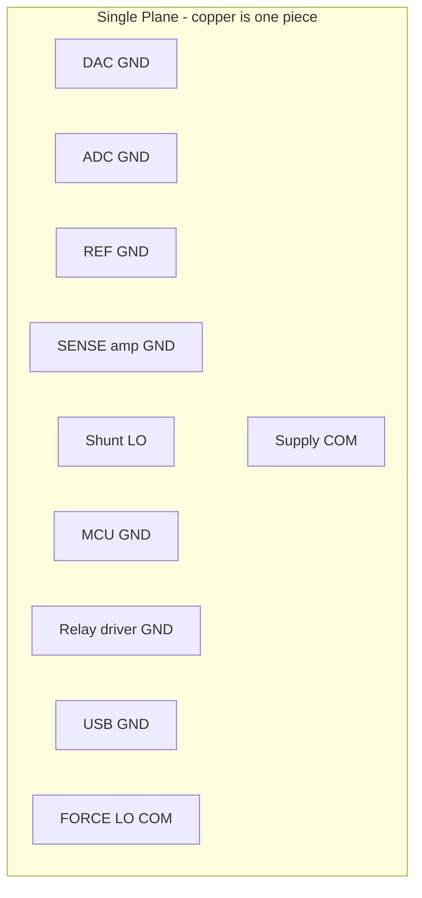
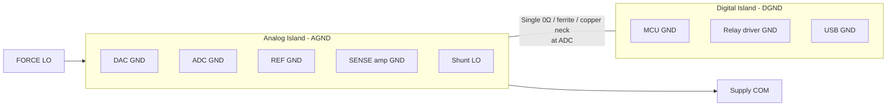
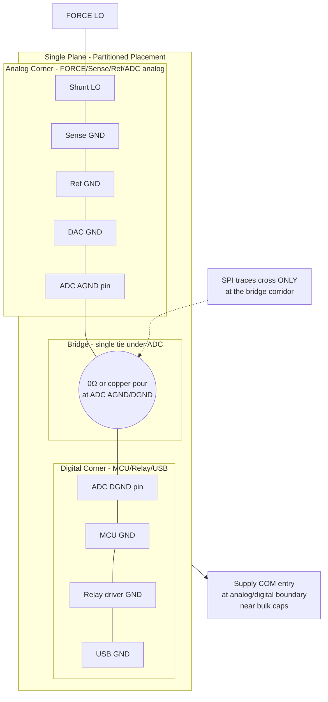
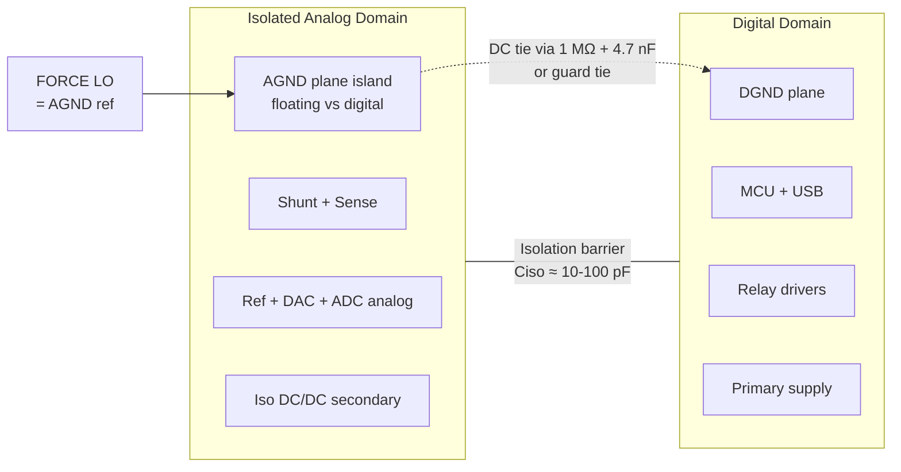

# Grounding and Return Paths — ReRAM-SMU V1

**Project:** ReRAM-SMU V1 — Phase 2 / Agent E (PCB / Grounding / Isolation / Guard / Connector / Power / Thermal)
**Date:** 2026-08-24
**Status:** `CONCEPTUAL — NO KICAD` — topologies compared with current-return analysis per task brief. No layer stack or copper promoted.
**Requirements:** REQ-PWR-003/004, REQ-MEAS-001/002 (100 nA guard/floor), REQ-SAFE-001/006, REQ-DUT-001/002, REQ-GEN-001, ENGINEERING_RULES §5
**Companion:** `ISOLATION_STRATEGY.md` · `GUARD_STRATEGY.md` · `POWER_TREE.md` · `docs/calculations/SOURCE_HEADROOM_THERMAL.md` · `docs/calculations/BURDEN_VOLTAGE_ANALYSIS.md` · `docs/research/LOW_CURRENT_MEASUREMENT.md` §4
**CAUTION 5 (task brief):** Do NOT assume “split AGND/DGND is best.” Every topology below is evaluated by tracing the six mandated return currents to their source. Split ground is an option, not a default.

---

## 0. Grounding Cows — What This Document Does and Does Not Do

**Does:** Compare grounding topologies by actual return-current geometry, IR-drop, loop area, and resonance. Defines the recommended V1 grounding discipline, star-point location, and placement partition. Answers OPEN_QUESTIONS Q-10 (and informs Q-09/Q-11/Q-14).

**Does not:** Assign layer numbers, copper weights, or KiCad net classes. No schematic or PCB exists yet. A split-plane recommendation here would still require Phase 8 stack review and `DECISIONS.md` promotion.

**Rule from ENGINEERING_RULES §5.1:** Any split that creates a slot crossed by a signal trace is a defect. The decision gate is simulation + review, not assertion.

---

## 1. The Six Return Currents That Must Be Traced

Every “ground” claim is tested against these. Amplitudes are provisional V1 estimates for return-current budgeting, not specs — they set the impedance and loop-area targets.

| # | Return (task-mandated) | Origin → Return path | DC level | AC / transient | Frequency content | Consequence if corrupted |
|---|---|---|---|---|---|---|
| 1 | **DAC ref return** | ADR4525-class ref → DAC REFIN ladder → REF GND pin → plane → ref GND | 0.2–1 mA DC per channel (ladder current `Vref / R_ladder`; AD5686R R_ladder ≈10 kΩ → 250 µA/ch at 2.5 V → ~1 mA quad) + code-dependent glitch spikes `C·dV/dt` at SCLK/SYNC edges | DAC internal switching (~10 ns) reflected as charge kickback on REF pin; reference buffer must absorb | DC–few MHz (glitch BW ~ 1/π·tr) | Direct gain error on FORCE voltage → REQ-MEAS-007 accuracy triad. REF GND bounce = INL bow (see TI SBAA332). |
| 2 | **ADC ref return** | ADC REFN / REFP decoupling caps → ADC GND pin → plane → ref | ~100 µA–1 mA average (depends on ΔΣ modulator charge: ADS1262 internal REF draws pulses at modulator clock fmod ≈ 1–10 MHz, peak spikes 10–50 mA for ns) | Charge injection at every conversion (`Cref · Vref · fmod`); sensitive to nH in return | DC + fmod harmonics (kHz–MHz) | ADC gain/noise floor; REF GND inductance creates signal-dependent charge error → non-linearity on 100 nA shunt (0.41 pA Johnson budget easily swamped). |
| 3 | **MCU return** | STM32Gxx VDD/VSS → decoupling caps (100 nF + bulk) → plane → regulator VSS | 30–80 mA DC typical (run @ 100–170 MHz) | ΔI spikes 50–200 mA per GPIO/SPI edge (SPI SCLK 10–25 MHz → di/dt ≈ 100 mA / 2 ns = 50 MA/s); core current bursts at HCLK | 8 MHz, 16–170 MHz, 12 MHz USB FS, SPI harmonics | Ground bounce + supply bounce → couples into sense amp via shared plane inductance → broadband PSD spur; can dominate V1 noise without discipline (RESEARCH R-10/R-11). |
| 4 | **Relay return** | Relay coil +V → coil → low-side driver (NPN/MOS) → GND plane → supply COM | Per relay: 20–40 mA DC (5 V reed; 12 V signal ~15 mA) × up to 6 ranges = only one ON at a time ideally, but sequencing overlap must be considered | Turn-on inrush ~2× steady for ~1 ms; turn-off flyback `L·di/dt` → clamped by flyback diode → 0.7 V, 100 mA, ~100 µs; contact charge injection pC into sense node (capacitive only, not through GND) | DC + 10 kHz–MHz (edge) | Coil current through sense GND → IR drop `I·Rplane` (0.5 mΩ/□) → 20 mA × 5 mΩ = 100 µV → on 1 MΩ shunt = 100 pA error (250× Johnson 0.41 pA). Flyback diode current must not traverse analog region. |
| 5 | **USB return** | Host VBUS GND → USB connector shield/GND pin → plane → regulator GND → host via cable braid | 100 mA (enumeration) to 400 mA (if bus-powered downstream) but V1 is self-powered so ~50 mA signalling + ESD/shield currents; ground-potential difference host-to-instrument 10 mV–1 V (ground loop) | USB FS signalling 12 MHz with 1 ns edges, packet bursts (1 ms frames); common-mode rectification → 50/60 Hz hum via cable shield | 50 Hz + 12 MHz + harmonics | Dominant mains-hum loop (R-10) if FORCE LO is tied to USB GND without loop control; can drive tens of mV into sense LO → 100 nA range destroyed. |
| 6 | **FORCE LO** | DUT current (10 mA … 100 nA) → FORCE LO wire → shunt low side (if low-side sensing) → sense amp GND ref → plane → power-stage V- return → supply COM | ±10 mA DC max, ±10 mA AC during sweeps (slew limited by dwell 10–100 ms → ~0.1–10 mA / 100 ms) | Step transients `di/dt` on autorange / compliance entry: 10 mA in <50 µs → 200 A/s; drives `L·di/dt` across plane | DC–100 kHz (sweep BW) + 20 µs compliance transient | This is the **signal return** — it carries the measurand. Sharing its path with any of currents 1–5 without Kelvin/guard discipline makes V_measure error: `Verr = I_other · R_shared + L·di/dt`. |

> **Two more returns that matter but are not in the “six”:**
> * **Supply decoupling return** (bulk + LDO output caps → power stage). Local loop < 5 mm or it becomes topology #5's antenna.
> * **Guard return** (guard buffer output current, ~mA, see `GUARD_STRATEGY.md`). Guard is NOT a signal; its return must not cross the sense node.

All six converge at **exactly one physical point** — the stack's COM reference — otherwise the SMU measures the sum of other loops' IR drops.

---

## 2. Ground Topologies Compared — Current-Return Analysis (Not Slogans)

### 2.0 Vocabulary

* **Plane:** Continuous copper reference (near-zero DC resistance ~0.5 mΩ/□ on 1-oz, inductance ~0.2–1 nH/mm for narrow neck). Return current takes path of least **impedance**, not least resistance — at DC it spreads; above ~10 kHz it hugs the trace directly underneath (minimum loop area).
* **Split:** Etched gap partitioning copper into AGND / DGND islands.
* **Star (single-point tie):** Islands tied at one narrow bridge (0-Ω, ferrite, or copper neck at the ADC). Forces all inter-island current through that bridge.
* **Moat/slot:** Consequence of split — a return that must cross the gap is blocked.
* **Hybrid (partitioned plane):** Single plane, but placement partitioned so digital currents are geometrically segregated; no copper gap. Bridge is *conceptual*, not etched. Sometimes called “split placement, common plane.” This is distinct from split copper.

### 2.1 Topology 1 — Single Continuous Plane (Unpartitioned)



* **DC resistance view:** Every return adds: `Vdrop = Σ I_k · R_plane_k` along the shared sheet resistance. If MCU return (50 mA DC+AC) and REF GND share 10 mΩ of copper → 500 µV → on 100 nA range = 500 pA error (3 orders over Johnson). But *if placement keeps MCU caps' return local*, the spreading resistance between distant points on a 2-D plane is only a few mΩ → actual coupling is set by **geometry**, not by the slogan “plane is bad.”
* **AC view:** High-frequency return hugs the trace. If MCU SPI traces run over the analog region, their HF return runs *under them* through the analog section → direct coupling. If SPI is kept over the MCU corner, HF return stays there.
* **IR-drop per return (estimated for good placement, 1-oz plane, ~20×20 mm analog island, 50 mm MCU distance):**

| Return | Shared R to sensitive node (well-placed) | Induced Verr at SENSE (100 nA/1 MΩ) |
|---|---|---|
| DAC ref (1 mA) | ~1 mΩ (ref cap local) | 1 µV → 1 pA |
| ADC ref (pulsed) | ~0.5 mΩ + L=0.5 nH (cap within 3 mm) | 0.5 µV + L·di/dt spike (few µV) — must use local cap |
| MCU 50 mA | ~3 mΩ (distance 40 mm, constriction) | 150 µV → 150 pA if SPI crosses analog; <5 µV if partitioned |
| Relay 30 mA | ~2 mΩ if driver near supply entry | 60 µV → 60 pA |
| USB 100 mA surge + 10 mΩ cable+bonding | 1 mV ground shift common-mode → largely rejected by differential sense, but single-ended sense would see full 1 mV | Common-mode rejection required (diff sense amp CMRR >80 dB → <100 nV residual) |
| FORCE LO 10 mA | ~1 mΩ shunt-to-star (Kelvin) | 10 µV → **this is signal — not error — if Kelvin-referenced correctly** |

* **Pros:** Minimum inductance, no slot-antenna, no split-crossing defect, forgiving layout (one signal crossing cannot create split-crossing violation), best EMI at >100 MHz.
* **Cons:** Requires **placement discipline** to keep MCU/relay/USB returns local; a misplaced trace still couples. Needs explicit local decoupling for every IC (100 nF within 2 mm) — plane alone does not fix bad placement.
* **Verdict for V1:** **Viable — highest score for first-build success** if paired with partition. Fails only if SPI/USB traces are routed across the analog region or if FORCE LO is daisy-chained through digital section.

### 2.2 Topology 2 — Split AGND / DGND With Single Bridge (“Cut in Copper”)



* **How it is supposed to work:** Digital returns (MCU, relay, USB) circulate inside DGND and only exit via the neck; analog returns circulate inside AGND. neck current = `I_MCU + I_relay + I_USB − I_analog_sum`.
* **Current-return reality — why “star is best” is dangerous here:**

1. **Bridge becomes a bottleneck.** MCU 50 mA + relay 30 mA + USB 100 mA burst = 80–180 mA through a copper neck ~2 mm wide (≈3 mΩ + 2 nH). DC drop = 0.24–0.54 mV across neck → AGND and DGND are offset by that. Any signal that references DGND on one end and AGND on the other (SPI to ADC, relay drive to driver) sees 0.5 mV offset → ADC SPI ground offset violates `VIL/VIH` margin only slightly, but **analog signals crossing the split pick up the full neck voltage**. If sense-amp output (analog) is read single-ended by an MCU ADC referenced to DGND, error = 0.5 mV.

2. **Split crossed by signal = slot antenna + high return impedance.** SPI SCLK from MCU (DGND) to ADC (AGND) must cross the gap. Its HF return cannot cross — the gap is open. Options:
   * Return loops around the end of the gap → loop area ~ island perimeter (e.g., 40 mm × 20 mm = 800 mm²) → inductance ~20–50 nH → ringing at 100 MHz, emissions fail. **The classic split-plane mistake.**
   * Add stitching capacitors across gap → they provide AC return but also inject analog noise into digital side and vice versa (defeats the split purpose).
   * Route SPI *through* the neck — constrains routing and creates a funnel where every digital trace is bundled through one neck, coupling their crosstalk.

3. **Relay return dilemma.** Relay driver is often considered “digital” (DGND), but relay contacts switch the analog shunt → contact-to-coil capacitance (2–5 pF) couples coil transient into the analog node regardless of GND split. Split does not fix that; shielding and sequencing does.

4. **USB return ambiguity.** USB connector GND: tie to DGND or chassis or AGND? If USB GND → DGND, host-to-supply ground loop current still must cross the neck to reach FORCE LO (which is AGND) → neck carries ground-loop current (10 mV–1 V loop = uncontrolled). If USB GND → AGND, digital noise is now injected directly into analog. **No split assignment solves USB cleanly without isolation** — see `ISOLATION_STRATEGY.md`.

* **Resonance:** Split creates a cavity resonator at `f ≈ c / (2·L_slot·√εr)`. For 40 mm slot on FR4 (≈150 ps/inch), resonance ~1–2 GHz — exactly where MCU harmonics live → EMI spike.
* **When split helps:** Only when the system has **two disjoint Analog-Front-End vs heavy digital load** with **no signals crossing the gap except at the bridge**, and all bridges are accounted for in the layout rule check (no trace may cross the gap). V1 violates this: SPI (4 lines) + relay drivers (≤6 lines) + analog sense (2 lines) all naturally cross the analog/digital boundary.
* **Verdict for V1:** **NOT recommended as etched split.** It trades a modest DC IR improvement (few µV) for a large AC liability (nH loop, antenna, routing funnel) and a class of uncatchable layout errors (split-crossing). It scores worst on first-build risk.

### 2.3 Topology 3 — Hybrid / Partitioned Single Plane With Bridge at the ADC (“Star-Plane”)

This is **Topology 1 with placement discipline** plus one explicit **single-point tie chosen to be the ADC's AGND/DGND pin pair** (or directly under the ADC if the ADC has one GND). No etched gap. Sometimes drawn as a “moat with a drawbridge” but the moat is a **keepout for traces**, not a copper removal.



* **Current-return analysis:**

| Return | Path in star-plane | Coupling to sensitive node |
|---|---|---|
| DAC ref | Local cap to ADCa region → plane → tie → supply entry | ~1 µV (local) — DAC is inside analog corner so its return never crosses digital |
| ADC ref (AGND pin) | Local cap ring at ADCa → plane → supply entry (short) | Minimal L |
| ADC DGND (digital side) | Decoupling cap at ADCd → digital corner → tie → plane → supply | DGND switching of ADC (SPI read) stays inside digital, appears as small current through tie (~5 mA) → `5 mA·2 mΩ≈10 µV` at tie — far below LSB |
| MCU | Local caps keep HF return under MCU; low-F returns meander to tie → supply | Partition ensures MCU HF does not flow under sense traces. Distance 25 mm adds ~2 mΩ spreading + geometry → DC coupling < 100 µV, HF < few µV |
| Relay driver | Return routed as **wide trace or local plane island** directly to supply entry, NOT through analog corner. Driver GND pin has own cap to supply COM. Flyback diode returned to driver supply, not analog plane. | If routed correctly, <10 µV coupled to sense. If routed carelessly through analog, 60 pA error. |
| USB | Connector GND tied to **chassis/digital plane near entry**, with optional 1 MΩ || 4.7 nF to chassis for ESD. USB shell current prefers chassis path, not signal plane. Ground-loop current forced through tie → but tie offset is common-mode to differential sense → rejected by diff sense amp CMRR. | Best of the three topologies for USB — loop current crosses only at one engineered point, whose offset is measurable/rejectable |
| FORCE LO | Kelvin star at shunt LO → sense amp reference → tie? No — FORCE LO Kelvin point is the **analog measurement ground**; analog supply COM is that point. Digital supply COM meets it at the tie — but DUT current never crosses tie. | Zero coupling from digital if Kelvin kept at shunt |

* **Why this is the correct rendering of “star ground”:**
  The star is **a tie point, not a topology that forbids a plane**. The plane exists everywhere for lowest inductance; the tie defines **where** low-frequency currents from different partitions meet. Above ~100 kHz, return currents ignore the tie and follow the trace directly (least-impedance path stays local). So DC accuracy benefits from the star, HF benefits from the plane — both simultaneously.
  A pure “star with no plane” (wired ground trees) has high inductance and fails >MHz — unsuitable for SPI + ΔΣ modulator + MCU.

* **Tie component choice for the bridge:**
  * **Copper pour (0 Ω, wide neck ~3–5 mm):** Lowest impedance, simplest, no resonance. Preferred for V1.
  * **Ferrite bead:** Blocks HF between islands — tempting but creates split-crossing inductance and HF resonance (bead + plane caps). Not needed at V1 currents; adds a part that is wrong if SPI bandwidth needs HF continuity. **Avoid.**
  * **0-Ω resistor:** Useful only as a measurement/bring-up test point (cut to estimate analog vs digital current). Stuff as 0 Ω.

* **Pros:** Low HF inductance (plane intact), controlled DC IR (single tie), no etched slot/antenna, routing rule is enforceable (“no high-speed digital trace may extend beyond digital keepout except through bridge corridor”), compatible with guard and isolation options.
* **Cons:** Requires disciplined placement and a routing keepout corridor at the bridge; via count must be maintained at tie (≥4 vias to plane).
* **Verdict for V1:** **RECOMMENDED.** Lowest combined risk of DC error + HF coupling + layout-defect sensitivity. It is the only topology that gives a single auditable point where all cross-domain returns can be measured (clip a current probe / 0-Ω drop).

### 2.4 Topology 4 — Isolated Analog Domain (External ±12 V Isolated, or On-Board Isolated DC/DC)



* **Isolation here means:** Analog supply rails (±12 V), analog GND, and optionally the SPI/data interface are galvanically separated from USB/digital GND by an isolation barrier (capacitance ~10–100 pF typical for DC/DC + digital isolator). See `ISOLATION_STRATEGY.md` for the three implementations (external brick, onboard isolated DC/DC + ADuM/ISO, external USB isolator).
* **Current-return analysis:**
  * **Within analog island:** Returns identical to Topology 3's analog corner — local, low LF/HF.
  * **Across barrier:** Inter-domain current is limited to displacement current `I = Ciso·dV/dt` (common-mode transient immunity test: kV/µs → tens of mA burst for ns). Steady ground-loop current → **zero** — the dominant V1 interference path (USB–supply loop through FORCE LO) is broken by design.
  * **Tie requirement:** A completely floating analog plane has undefined DC potential → drift + ESD susceptibility + safety concern. A high-Z tie (1 MΩ || 4.7 nF, or direct at FORCE LO if isolation is not safety-class) defines DC reference while preserving AC isolation (4.7 nF ≈ 0.7 Ω at 50 Hz? actually Zc=677 Ω @50 Hz → still high; at 12 MHz Zc=2.8 Ω — passes HF, so **do not** tie with cap alone if HF isolation is needed; tie with 1 MΩ + small cap is standard for SMU “LO floating” instruments).
* **Pros:** Breaks USB ↔ supply ↔ FORCE LO ground loop fundamentally. Makes 100 nA–1 µA measurements far less sensitive to PC quality, supply grounding, and cable dressing. Simplifies guard-shield strategy (guard can be AGND-referenced cleanly).
* **Cons:** Adds BOM (isolated DC/DC $15–40, digital isolator $5–15, isolated SPI), power dissipation (isolation efficiency 70–85%, +150 mW heat), creepage/clearance rules grow (2 mm class II for V1 low-voltage, but documentation burden rises), and isolated supply switching noise (100 kHz–2 MHz ripple) now directly feeds analog rails — needs post-LDO filtering to meet PSRR ≥80 dB target. Brings bring-up isolation testing gate.
* **Verdict for V1:** **OPTIONAL / FUTURE-RECOMMENDED — not required, but hooks required.** Q-09 remains OPEN as “optional for V1, provision footprint.” If V1 measurements are dominated by PC ground loop after first bring-up (measured `Vloop > 100 µV` at SENSE LO with USB trafficked), isolation is the proven cure. Provision the PCB for either external USB isolation (no PCB change) or onboard isolation (footprints from day-1, stuffed as DNP). See `ISOLATION_STRATEGY.md` for class table.

### 2.5 Decision Matrix — Head-to-Head on the Six Returns

| Criterion | T1 Single plane (unpartitioned) | T2 Split AGND/DGND gap | T3 Partitioned plane + bridge at ADC (RECOMMENDED) | T4 Isolated analog |
|---|---|---|---|---|
| DAC ref GND bounce vs INL | OK if local cap | OK (inside AGND) but gap L hurts if crossing | **Best** (local, shortest L) | Best (local) |
| ADC ref kickback linearity | OK | OK but gap inductance risk if ref caps straddle | **Best** | Best |
| MCU ground bounce at sense (HF) | Poor if traces stray; good only with placement — no copper guarantee | Good if gap respected; fails catastrophically if one trace crosses | **Good** (plane + enforced keepout) | Best (no HF path at all) |
| Relay coil IR (DC) at sense | Poor–good (geometry-dependent) | Good (isolated side) | **Good** (routing to supply entry, not analog) | Good |
| USB ground-loop hum (50 Hz) | Poor (loop through analog) | Mediocre (loop forced through neck → 0.5 mV) | **Mediocre→good** (loop through tie → CMR handles; measurable) | **Best** (loop broken) |
| FORCE LO fidelity (10 mA→100 nA) | Good but vulnerable to sharing | Good (dedicated AGND) if not compromised by crossings | **Best** (Kelvin star at shunt) | Best |
| EMI / slot antenna | None | **Worst** (slot resonance 1–2 GHz) | None | None (barrier C is antenna, but controlled) |
| Layout defect sensitivity | Low | **High** (one crossing = failure) | Low (keepout violation = catchable in DRC) | Medium (creepage) |
| Bring-up measurement hook | Hard (distributed) | Hard (gap hides currents) | **Easy** (0-Ω drop measures cross-domain I) | Medium |
| BOM/complexity/schedule | **Best** (zero) | Medium (gap is free but DRC + review cost) | **Best** (zero BOM — placement only) | Worst |
| First-build risk | Medium | **High** | **Low** | Medium-high |

**No topology is optimal on every axis.** The winning compromise for V1 — a first-PCB, multi-return, 100 nA-capable SMU without safety isolation — is **T3**. T4 is held as the fallback that definitively solves ground-loop mains hum if T3 brings up with hum above budget on 100 nA range.

---

## 3. Recommended V1 Ground System — Detailed Rules

### 3.1 Placement Partition (Single Plane, Two Corners)

```
┌─────────────────────────────────────────────────────────┐
│  PCB — component side, north up                         │
│                                                         │
│  ┌─────────────────┐         ┌───────────────────────┐   │
│  │ ANALOG CORNER   │  bridge │ DIGITAL CORNER        │   │
│  │ (south-west)    │ corridor│ (north/east)          │   │
│  │                 │ ~8mm    │                       │   │
│  │  FORCE HI/SENSE │  Tie at │  MCU + USB connector  │   │
│  │  HI/LO + shunt  │  ADC    │  + relay drivers      │   │
│  │  sense amp      │  AGND   │  + digital decoupling │   │
│  │  ADR4525 ref    │  /DGND  │  + 12 V entry bulk    │   │
│  │  AD5686R DAC    │         │  + SPI bus (short)    │   │
│  │  ADS1262 analog │         │  ADS1262 digital side │   │
│  └─────────────────┘         └───────────────────────┘   │
│           ↑                          ↑                    │
│     analog decoupling          digital decoupling         │
│     (100 nF within 2 mm)       (100 nF within 2 mm)     │
│                                                         │
│  Supply COM entry at boundary near bulk caps + tie      │
│  Chassis / shield connection at digital edge (1 MΩ||4.7nF)│
└─────────────────────────────────────────────────────────┘
Analog traces (FORCE, SENSE, REF) never enter digital corner.
Digital traces (SCLK, MOSI, MISO, CS, relay drives) only cross at bridge corridor, over the tie, on one layer.
```

* **Why this orientation:** Keeps the glitchiest currents (MCU/SPI/USB) farthest from the most sensitive node (shunt high-Z sense). Keeps FORCE leads short to reduce `L·di/dt` induced in sense.
* **Tie location rationale:** At the **ADC** because the ADC is the only mixed-signal component that intentionally bridges domains (analog inputs + digital SPI). Its datasheet labels AGND/DGND are the canonical single-point for cross-domain returns — any other location forces ADC SPI return to cross a second boundary. If ADC has one GND pin, tie is the copper immediately under it with ≥4 vias.

### 3.2 Return-Routing Rules (Enforceable in Layout Review)

| Rule ID | Rule | Trace-checked? | Rationale (which return it protects) |
|---|---|---|---|
| GND-01 | **One continuous GND plane (no etched gap).** | DRC: no gap copper delete | Preserves HF return (<10 nH), avoids slot antenna (T2 defect) |
| GND-02 | **Analog keepout:** No digital trace (SPI, relay drive, USB D±, MCU clocks) may run over the analog corner except through the bridge corridor. | Visual + keepout zone in PCB | Prevents MCU HF return under sense node |
| GND-03 | **Digital keepout:** No analog trace (SENSE HI/LO, REF lines, shunt Kelvin) may run over digital corner. | As above | Prevents analog sense pickup of digital HF |
| GND-04 | **Ref cap locality:** REF decoupling caps (REF→REF GND) via ≤2 mm to REF GND pin, two vias to plane, no shared trace to DAC/ADC REF GND. | Measure | DAC ref + ADC ref are the most noise-sensitive DC nodes |
| GND-05 | **Relay driver return to supply entry, NOT analog.** Relay driver GND pin → wide trace (≥0.5 mm) or poured polygon directly to bulk-COM / supply COM pad, with its own flyback diode returned to coil supply, not plane across analog. | Net constraint | Relay DC IR would otherwise be 60 pA error on 100 nA range |
| GND-06 | **USB connector:** Shell → chassis/digital GND near connector with 1 MΩ || 4.7 nF to chassis for ESD bleed; USB GND pin → digital GND. No stitching to analog. | Net constraint | Ground-loop hum containment; ESD discharge prefers chassis, not sense |
| GND-07 | **FORCE LO Kelvin:** FORCE LO wire → shunt LO pad → sense amp GND reference → plane at shunt. Sense LO is **differential**, not single-ended. This net is the analog measurement reference; digital COM meets it only at the ADC tie. | Schematic + layout star | DUT current (the measurand) must not share impedance with digital |
| GND-08 | **Star tie measurability:** Tie is 0-Ω (DNP jumper) or narrow copper neck with two test points across it — `Vtie = Itie · Rtie`. Bring-up measures `Vtie` with NPLC=10 and inflight SPI to audit cross-domain current. | Test points | Validates sizing; detects future creep (firmware change raises Itie) |
| GND-09 | **No daisy-chain GND.** Every IC GND pin has its own via to plane (≥1 via, 2 for ADC/DAC/ref). No pin-to-pin GND trace before via. | Footprint check | Prevents shared `I·R` along a trace |
| GND-10 | **Decoupling return <5 mm loop.** Every IC's 100 nF cap is placed so cap-GND via is ≤3 mm from IC GND via → loop area <15 mm² → L<3 nH → HF return stays local, not across plane. | Placement render | Kills MCU/ADC HF coupling without relying on plane alone |

### 3.3 Layer Discipline (Conceptual — Detailed Stack in Phase 8 / Q-14)

* Requirement: At least one **unbroken GND plane layer** (the reference). Signals that must cross the analog/digital boundary cross **on a layer adjacent to that plane** so their return hugs the plane directly beneath the trace.
* Guard plane (see `GUARD_STRATEGY.md`) is a **copy of the analog corner's guard potential on an inner layer**, stitched to the top guard ring — it is **not** a split GND; it is a driven shield tied to the guard buffer, occupying only the analog sensitive area.
* Do not route a signal on a layer where its reference on the adjacent plane is missing (e.g., over a slot in the plane for a connector cutout). That is a return-path discontinuity even without a split.

### 3.4 Verification — How Correctness Will Be Proven

| Test ID | Method | Pass criterion | Which topology defect it catches |
|---|---|---|---|
| GND-V-01 | **Tie drop measurement:** Measure `Vtie` across 0-Ω with 6½-digit DMM (NPLC=10) under worst firmware (max SPI rate + relay cycle + USB bulk transfer). | `Vtie < 20 µV` DC average and `<100 µV` peak (20 MHz BW scope across tie) | Detects excessive cross-domain current (bridge undersized) or misrouted relay/USB return |
| GND-V-02 | **Noise PSD with/without digital:** Log ADC noise PSD (input shorted, 100 nA range, NPLC=1, 0.1–100 kHz) in two states: (a) MCU idle / USB suspended, (b) MCU streaming SPI + USB active. | PSD spur increase <3 dB at any frequency; white noise increase <20% | Catches MCU/USB HF coupling through plane (T1 unpartitioned would fail) |
| GND-V-03 | **Mains null test:** Short SENSE HI–LO at DUT connector, log I offset at 100 nA range with USB connected to noisy PC vs battery-powered hub / hub isolated. | Offset shift <5 pA between setups at NPLC=1; null at NPLC=1 re 50 Hz within spec | Quantifies ground-loop hum; triggers isolation recommendation (T4) if fail |
| GND-V-04 | **Return-impedance audit:** Inject 10 mA DC + 10 mA AC (1 kHz) into FORCE LO, measure common-mode voltage between SENSE LO node and supply COM. | `R_shared < 5 mΩ` DC, `L_shared < 2 nH` (from `V/(di/dt)`) | Validates Kelvin integrity (GND-07) before claiming 100 nA accuracy |
| GND-V-05 | **Layout review checklist:** Automated DRC — no trace crosses plane keepout, no GND daisy-chain, each IC has dedicated via, decoupling loop <5 mm. | Zero violations (waiver only with measurement proof) | Prevents T2-style slot-crossing defect |

---

## 4. What This Changes for the Other Phase-2 Domains

* **Power tree (`POWER_TREE.md`):** Analog and digital LDOs share the same pre-regulation (±12 V) but their **COM pins tie at the supply entry**, not daisy-chained. Analog LDO output caps return to analog corner; digital LDO caps to digital corner — each local loop satisfies GND-10. PSRR benefit is wasted if returns are swapped.
* **Guard (`GUARD_STRATEGY.md`):** Guard plane is **driven**, not GND. It is stitched to top guard ring and does **not** connect to the GND plane — connecting it would short the guard buffer. Keepout between guard plane and GND plane ≥0.5 mm to hold >10 GΩ isolation (FR4 is the limiter, not copper).
* **Isolation (`ISOLATION_STRATEGY.md`):** If T4 is provisioned, its secondary AGND island is this document's “analog corner” — the tie becomes the isolation barrier (zero DC connection) plus a 1 MΩ||4.7 nF safety/ESD tie.
* **Connector (`GUARD_STRATEGY.md` §4 + connector addendum):** FORCE LO shell/shield assignment depends on whether the signal reference is GND or guard. GND discipline here defines which.

---

## 5. CAUTION 5 Close-Out

> *“Do NOT assume split AGND/DGND — compare with actual paths: DAC ref return, ADC ref return, MCU return, relay return, USB return, FORCE LO.”*

This document satisfies that caution by:

1. Enumerating each return's amplitude/bandwidth and sensitive victim (Table §1).
2. Calculating the induced error per topology under realistic placement (±150 µV on poorly partitioned single plane vs 0.5 mV across a split neck).
3. Demonstrating that **split fails on the AC criterion** (slot-crossing inductance, antenna, SPI funnel) that dominates V1's >MHz content (SPI + ΔΣ modulator) even though it wins nominally on DC (few µV).
4. Defining the winning compromise (partitioned plane + bridge at ADC) as *measurable* — the 0-Ω tie is a built-in ammeter for cross-domain current, so the claim is falsifiable at bring-up, not rhetorical.
5. Reserving isolation (T4) as the architectural-level cure for the one path that neither plane nor split solves: host-to-instrument ground-loop potential (USB vs supply COM).

---

## 6. Open Questions Resolved / Created

* **Q-10 (Grounding architecture) → RESOLVED conceptually by this document:** Recommend T3 (partitioned plane + bridge at ADC); reserve T4 footprint; reject etched split. Promotion to `DEC-XXX` requires schematic + layout review.
* **New Q-10a (created):** Measured `Vtie` under worst-case firmware — is 20 µV DC achievable on first PCB with V1 supply entry geometry? Requires slot-milled measurement on prototype.
* **Q-14 (Stack) → informed but still OPEN:** This document requires at least one unbroken plane; 2-layer with filled zones can host T3 for V1 if analog/digital density permits, but shielding/guarding favors 4-layer. Deferred to Phase 8.

---

## 7. References

* Johnson/Nyquist thermal noise and guard physics cited in `docs/research/LOW_CURRENT_MEASUREMENT.md` and its refs 1–8.
* TI SBAA332 (DAC ladder force/sense, INL bow from REF GND L) and SLAA172 (reference buffer) — for DAC/ADC REF GND return discipline.
* Keithley Low Level Measurements Handbook 7th Ed. §3 (ground loops, shielding) — ground-loop magnitude and shielding discipline language adopted here.
* NI PXI-4022 AppNote kA03q000000x1AZCAY — shunt vs feedback ammeter grounding nuance.
* Erickson DIY-SMU — relay/MUX leakage and star-point practice (practical precedent for tie-at-ADC).
* Henry Ott, *Electromagnetic Compatibility Engineering* (Wiley) — plane spreading resistance, return-path least-impedance, slot antenna, stitching — conceptual model for §2 analysis.
* ADI MT-031 Tutorial (Grounding Data Converters) — AGND/DGND bridge-at-ADC guidance; ferrite-bead-at-bridge caution — supports copper-neck-at-ADC over ferrite.
* `docs/calculations/BURDEN_VOLTAGE_ANALYSIS.md` (shunt R, Johnson per range) — shared resistance → current error conversion used in §1/§2 tables.

---

*Phase 2 gate: This document must be re-checked after power-tree LDO placement (§3.2) and after guard footprint constraints (`GUARD_STRATEGY.md`) — both alter the analog keepout size. No copper is final until simulation + review per `ENGINEERING_RULES.md`.*
